# Анализ паблика "Суровый Технарь"

С помощью утилиты [vk_public_analyzer](https://github.com/qiray/vk_public_analyzer) проведем анализ содержимого паблика Суровый Технарь (https://vk.com/brutalengineer) и поищем интересные закономерности в данных. Выгрузка данных сделана 29 апреля 2019 года.

## Общие данные

Для начала посмотрим на общие данные с ноября 2011 по апрель 2019:

| Parameter   | Count     | Average (Mean) | Median | Mode | Stdev     |
|-------------|-----------|----------------|--------|------|-----------|
| Posts       | 31557     |                |        |      |           |
| Likes       | 10262489  | 325.2          | 193    | 73   | 382       |
| Reposts     | 1414053   | 44.81          | 19     | 1    | 75.99     |
| Comments    | 2053789   | 65.08          | 44     | 24   | 98.35     |
| Views       | 446796754 | 1.416e+04      | 0      | 0    | 1.706e+04 |
| Ads         | 734       | 0.02326        | 0      | 0    | 0.1507    |
| Attachments | 40173     | 1.273          | 1      | 1    | 1.386     |
| Text        | 7839040   | 248.4          | 47     | 0    | 776.5     |

Из интересного стоит отметить существенную разницу между медианой и средним арифметическим по всем показателям, а также то, что мода (наиболее часто встречающееся значение) еще меньше.

Количество просмотров в данном случае почти не важно, потому что такой показатель появился в вк в 2017 году и отсутствует для более старых постов.

За все время поставлено больше 10 миллионов лайков, а также сделано почти 1,5 миллиона репостов и 2 миллиона комментариев. Страшно представить, сколько на это все было потрачено времени.

Средний пост в Суртехе содержит 248 символов, а медиана и того меньше - всего 47 (!). Т.е. большую часть постов можно без труда поместить в твит. Заставляет задуматься. Хотя, справедливости ради, стоит отметить, что здесь не учитываются статьи - вк считает их вложениями.

Чаще всего можно встретить пост длиной 47 символов с 73 лайками, 1 репостом, 24 комментариями и 1 вложением.

2% всех постов помечены как рекламные. Много это или мало, решайте сами.

## Топовые посты

### Самые комментируемые

| Post                                 | Max  | 
|--------------------------------------|------|
| https://vk.com/wall-31969346_57100   | 8975 |
| https://vk.com/wall-31969346_214271  | 6044 |
| https://vk.com/wall-31969346_350882  | 1973 |
| https://vk.com/wall-31969346_1280231 | 1953 |
| https://vk.com/wall-31969346_641911  | 1922 |
| https://vk.com/wall-31969346_602946  | 1435 |
| https://vk.com/wall-31969346_412657  | 1421 |
| https://vk.com/wall-31969346_588840  | 1407 |
| https://vk.com/wall-31969346_258171  | 1335 |
| https://vk.com/wall-31969346_94408   | 1196 |

Первое место с почти 9000 комментариев занимает давний опрос на тему "Взлетит/Не взлетит". Впрочем, ничего удивительного.

Второе место занимает математическая задачка. Чему равно значение выражения 6/2(1+2)? Этот вопрос привел к 6000 комментариев.

Третье место - дубль первого опроса. Второй раз результатом стали почти 2000 комментариев.

С остальными постами из топ-10 можете ознакомиться, посмотрев таблицу.

### Топ по лайкам

| Post                                 | Max  |
|--------------------------------------|------| 
| https://vk.com/wall-31969346_202531  | 8474 |
| https://vk.com/wall-31969346_193128  | 8389 |
| https://vk.com/wall-31969346_897822  | 6430 |
| https://vk.com/wall-31969346_126988  | 5831 |
| https://vk.com/wall-31969346_148782  | 5395 |
| https://vk.com/wall-31969346_126873  | 5158 |
| https://vk.com/wall-31969346_1320915 | 5157 |
| https://vk.com/wall-31969346_608453  | 5089 |
| https://vk.com/wall-31969346_124325  | 4889 |
| https://vk.com/wall-31969346_1600212 | 4657 |

Первое место по лайкам - ванильная картинка "Ток любит напряжение". 8474 лайка.

Второе - недоступное сейчас видео про экономистов. 8389 лайков.

Третье - канал какого-то мужика с самоделками. 6430 лайков.

Что интересно - большая часть топ-10 по лайкам - смешные картинки и мемы. Означает это не то, что кто-то куда-то скатился, а то, что людям интереснее эмоциональный контент.

### Топ по репостам

| Post                                | Max  | 
|-------------------------------------|------|
| https://vk.com/wall-31969346_193128 | 2206 |
| https://vk.com/wall-31969346_897822 | 2002 |
| https://vk.com/wall-31969346_124325 | 1564 |
| https://vk.com/wall-31969346_126988 | 1512 |
| https://vk.com/wall-31969346_202531 | 1403 |
| https://vk.com/wall-31969346_791977 | 1373 |
| https://vk.com/wall-31969346_126873 | 1359 |
| https://vk.com/wall-31969346_248899 | 1166 |
| https://vk.com/wall-31969346_148782 | 1100 |
| https://vk.com/wall-31969346_361578 | 1060 |

Первое место по репостам (2206 штук) занимает уже упоминавшееся видео про экономистов.

Второе место с результатом 2002 репоста у канала про самоделки.

Третье - отрывок из мультфильма Дилберт ("Нет, он будет инженером"). 1564 репоста.

### Самые длинные тексты

| Post                                 | Max   |
|--------------------------------------|-------|
| https://vk.com/wall-31969346_1020381 | 16384 |
| https://vk.com/wall-31969346_1840809 | 16198 |
| https://vk.com/wall-31969346_1840042 | 16144 |
| https://vk.com/wall-31969346_1790252 | 15988 |
| https://vk.com/wall-31969346_1776487 | 15803 |
| https://vk.com/wall-31969346_331615  | 15697 |
| https://vk.com/wall-31969346_1867899 | 15348 |
| https://vk.com/wall-31969346_2135771 | 14915 |
| https://vk.com/wall-31969346_1906895 | 14476 |
| https://vk.com/wall-31969346_1761691 | 14274 |

Самый длинный текст в Суровом Технаре - заметка о силе советского образования (16384 символа).

Вторая по величине - статья о реакторной установке КЛТ-40. 16198 символов.

Третье место у реактора РБМК-1000. Про него написали 16144 символа.

Остальные тексты из топ-10 - это справочные материалы, описания и одно открытое письмо.

### Самые просматриваемые

| Post                                 | Max    |
|--------------------------------------|--------|
| https://vk.com/wall-31969346_2296705 | 172288 |
| https://vk.com/wall-31969346_1982813 | 160464 |
| https://vk.com/wall-31969346_1707387 | 156719 |
| https://vk.com/wall-31969346_1981132 | 131772 |
| https://vk.com/wall-31969346_1735079 | 122990 |
| https://vk.com/wall-31969346_2225566 | 116499 |
| https://vk.com/wall-31969346_2297807 | 116497 |
| https://vk.com/wall-31969346_1948987 | 113927 |
| https://vk.com/wall-31969346_2296106 | 111639 |
| https://vk.com/wall-31969346_1705916 | 110507 |

Чаще всего в Суртехе смотрели:

- видео с аннигиляцией на производстве - 172 тысячи просмотров;
- видео с заменой лампочки на сверхвысокой мачте - 160 тысяч просмотров;
- почти 157 тысяч просмотров у решения проблемы несовпадения размеров сосиски и булки для хот-дога.

Остальной топ - всякая электродичь и прочие картинки. Стоит заметить, что данные по количеству просмотров не вполне корректны - показатель появился в 2017 году, у более ранних постов он равен 0.

### Пересечение топ-постов

Занятно то, что из всех топовых постов пересечения есть только у репостов и лайков, т.е. большинство лайков и репостов имеют одни и теже посты.

Комментируют чаще всего не то, что нравится, а то, что вызывает противоположные мнения, и может служить поводом для дискуссий. Самые длинные тексты тоже реже лайкают, репостят и комментируют.

## Записи без лайков и т.п.

За все время существования в Суртехе было:

- 7 постов без лайков;
- 1173 без репостов;
- 396 постов остались без комментариев;
- 3980 записей без вложений;
- 6157 постов с вложениями без какого-либо текста (снова привет твиттеру).

## Информация об авторах

Всего в Суртехе было 7465 известных авторов, включая "псевдоавтора" с id 0 - автора всех неподписанных постов. Больше 100 постов написали 11 человек.

Данные по топ-10 авторов выглядят так:

| Author                                          | Posts | Likes   | Reposts | Comments | Views     | Attachments | Text length | 
|-------------------------------------------------|-------|---------|---------|----------|-----------|-------------|-------------| 
| Не подписан                                     | 12368 | 3554995 | 575028  | 693540   | 153590065 | 12623       | 3221693     | 
| [Кирилл Грибков](https://vk.com/id440631604)    | 701   | 155677  | 17466   | 24798    | 21611518  | 1579        | 283957      | 
| [Сергей Иванов](https://vk.com/id4095831)       | 327   | 65743   | 12394   | 26425    | 101558    | 370         | 182037      | 
| [Евгений Колодезный](https://vk.com/id20074856) | 235   | 66048   | 15673   | 17566    | 0         | 337         | 111280      | 
| [Константин Ключев](https://vk.com/id22718855)  | 209   | 121402  | 7822    | 12006    | 8334857   | 239         | 6417        | 
| [Blgar Khan](https://vk.com/id86090826)         | 171   | 97166   | 10049   | 11746    | 4534164   | 266         | 63453       | 
| [Александр Иванов](https://vk.com/id10375047)   | 141   | 20694   | 1994    | 4275     | 1804082   | 146         | 17434       | 
| [Евгений Михайлов](https://vk.com/id209581462)  | 140   | 27559   | 3749    | 8045     | 2112293   | 222         | 115213      | 
| [Сергей Поделкин](https://vk.com/id256435878)   | 137   | 37752   | 4724    | 5526     | 1945590   | 142         | 23422       | 
| [Наталья Евгеньева](https://vk.com/id49283)     | 119   | 4371    | 449     | 968      | 2860904   | 172         | 93971       | 

Почти 40% всех постов не подписаны. Автор с наибольшим количеством постов написал около 2% постов Суровом Технаре. В топ-10 ожидаемо находятся несколько администраторов паблика. В среднем на каждый пост у топовых авторов приходится 1-2 вложения, что близко к среднему значению. А вот тексты у большинства длиннее, чем в среднем.

## Информация о вложениях

Всего в постах Суртеха 40173 вложения. Из них:

- 22 альбома;
- 272 аудиозаписи;
- 2354 документа;
- 1948 ссылок;
- 27 страниц;
- 21715 фотографий;
- 769 опросов;
- и 13064 видеозаписей.

Я ожидал, что видео будет больше, чем картинок, но ошибся. Думаю, перевес картинок связан с тем, что их обычно прикрепляют по несколько к посту, а видео - по одному. Или видео стало много в последнее время, а раньше было поменьше.

## Опросы

Опросы в Суртехе - вещь в себе. Интересно посмотреть статистику по ним.

Всего было проведено 769 опросов, в которых отдано почти 5 миллионов (!) голосов. В среднем в каждом опросе было 6460 участников. Медианное значение чуть меньше - 5745 голосов.

### Топ опросов

Всего было 126 опросов, в которых проголосовало больше 10000 человек. Топ-10 выглядит так:

| URL                                  | Votes | 
|--------------------------------------|-------| 
| https://vk.com/wall-31969346_214271  | 30771 | 
| https://vk.com/wall-31969346_57100   | 25785 | 
| https://vk.com/wall-31969346_641911  | 20076 | 
| https://vk.com/wall-31969346_1470245 | 19485 | 
| https://vk.com/wall-31969346_946609  | 18443 | 
| https://vk.com/wall-31969346_1426916 | 17654 | 
| https://vk.com/wall-31969346_997391  | 17614 | 
| https://vk.com/wall-31969346_577474  | 17421 | 
| https://vk.com/wall-31969346_358215  | 16500 | 
| https://vk.com/wall-31969346_412657  | 16410 | 

Первое место заняла уже упоминавшаяся задача про значение выражения 6/2(1+2). 30771 голос

Второе - вполне ожидаемо опрос на тему "взлетит или не взлетит". 25785 голосов

Третье - что лучше во время войны - массовость или качество вооружения. 20076 голосов

## Самые часто встречающиеся слова

Вот так выглядит облако всех слов, встречавшихся в Суровом Технаре:

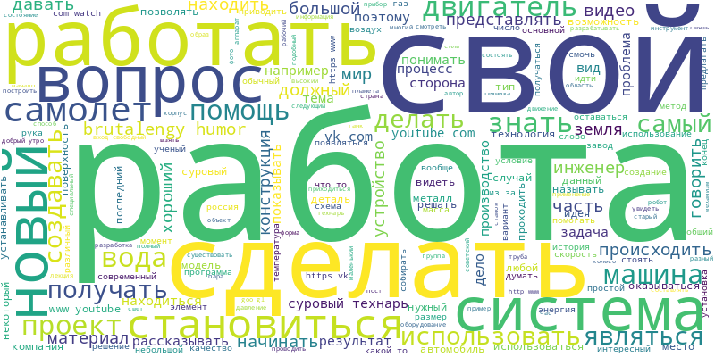

В глаза бросается сочетание "свой работа сделать"

А вот топ-30 слов:

| Слово       | Количество | 
|-------------|------------| 
| brutalengy  | 2544       | 
| работа      | 2384       | 
| свой        | 2288       | 
| 2           | 2078       | 
| 1           | 2056       | 
| вопрос      | 1984       | 
| система     | 1833       | 
| двигатель   | 1817       | 
| технарь     | 1807       | 
| суровый     | 1805       | 
| самый       | 1727       | 
| https       | 1666       | 
| новый       | 1540       | 
| работать    | 1469       | 
| большой     | 1415       | 
| сделать     | 1399       | 
| com         | 1387       | 
| самолет     | 1319       | 
| 3           | 1313       | 
| становиться | 1287       | 
| http        | 1279       | 
| ru          | 1210       | 
| 5           | 1205       | 
| вода        | 1179       | 
| проект      | 1178       | 
| скорость    | 1167       | 
| 4           | 1156       | 
| получать    | 1155       | 
| часть       | 1103       | 
| место       | 1090       | 

Чаще всего встречается brutalengy - тег Сурового Технаря. Интересно наличие в топе цифр от 1 до 5. Могу предположить, что они появились из наименований обсуждаемых изделий. http, https и ru очевидно взялись из размещенных в Суртехе ссылок на сторонние ресурсы. Остальные слова особого интереса не вызывают. Вполне логично, что Суровый Технарь обсуждает работу, двигатели, проекты, самолеты и т.п., есть рубрика "вопросы". Забавно, что слова "технарь" и "суровый" встречаются практически одинаково часто.

Топ слова несколько отличаются от общего списка:

И аналогичное облако для хэштегов:

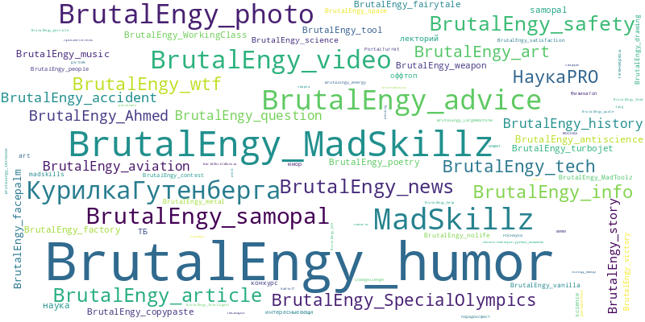

Анализ этих изображений предлагаю провести читателям.

## Анализ тем

Посмотрим, какие темы затрагивал Суровый Технарь, начиная с 2011 года. Чем больше вес, тем чаще встречается тема.

| Год  | Темы | 
|------|------| 
| 2011 | 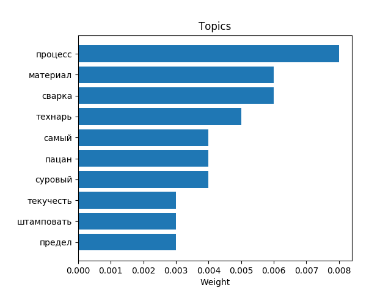 |
| 2012 | 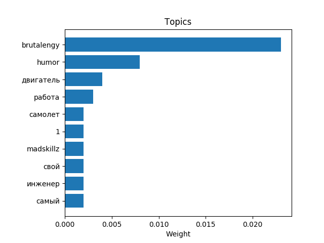 |
| 2013 | 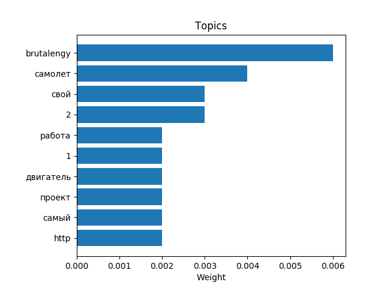 |
| 2014 | 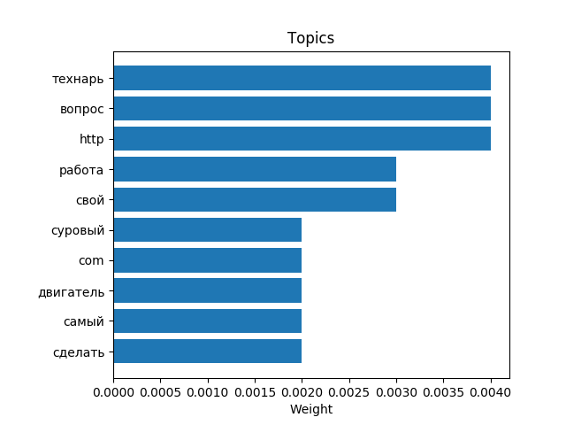 |
| 2015 | 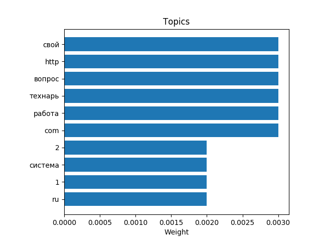 |
| 2016 | 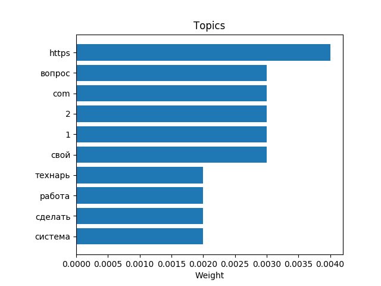 |
| 2017 | 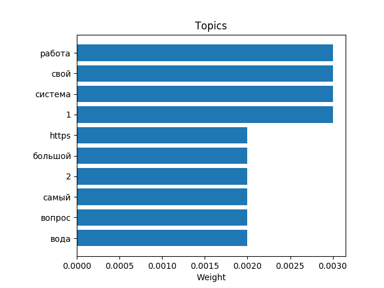 |
| 2018 | 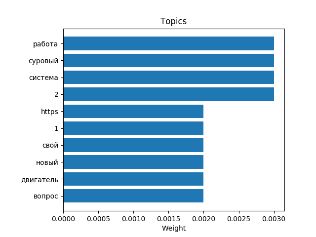 |
| 2019 | 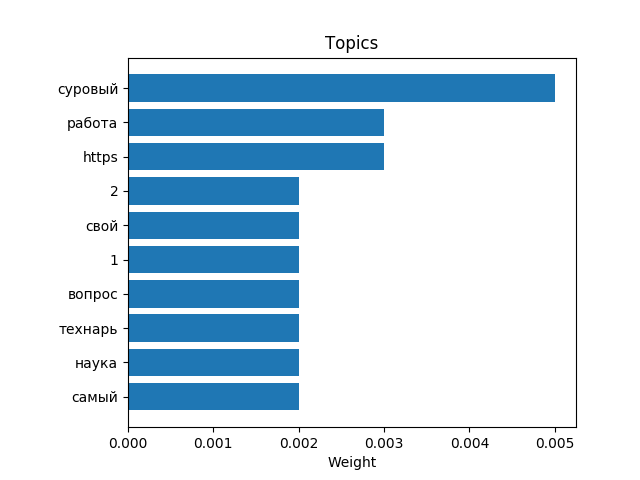 |
| Общее за весь период | 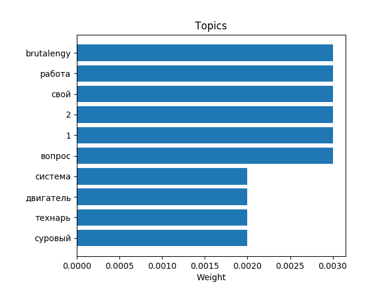 |

В 2011 Суровый Технарь интересовался процессом, материалами, сваркой, текучестью, пределом и штамповкой. А еще здесь случайно возникло восхитительное сочетание тем - "технарь самый суровый пацан".

В 2012 появлились теги brutalengy, humor и madskillz. Стали обсуждать работу, инженеров, двигатели и самолеты.

В 2013 инженеры ушли, но появились проекты, ссылки (http) и номенклатура изделий. Самолеты стали выше.

В 2014 в топ ворвались вопросы технарю, ссылок стало больше, а самолетов меньше.

С 2015 по 2019 технарей интересует: вопросы, работа, сами технари, системы, что-то свое, номенклатура изделий и сторонние ссылки. В 2016 на первое место вышли сторонние материалы. В 2017 самым важным было обсуждение работы. 2018 - работа, что-то суровое и системы. В 2019 слово "суровый" впервые стало лидером.

За весь период лидируют теги, работа, числа, вопросы, системы и двигатели, а также технари суровые (звучит как название биологического вида).

## Графики

Напоследок несколько любопытных графиков, показывающих параметры по годам, кварталам, месяцам, дням недели и часам. На графиках представлено количество постов и средние данные по ним - лайки, репосты, комментарии, вложения, просмотры и длина текста. 

**Важно!** Все параметры показываются для соответствующих постов. Т.е., например, лайк, защитанный в 2019 году, - это лайк, поставленный посту, вышедшему в 2019 году. Если лайк в 2019 году поставлен посту 2018 года, то он будет засчитан в данных 2018 года. Все данные приведены по московскому времени.

Данные по годам:

Год от года количество постов росло (снижение в 2019 естественно, статья писалась, когда год еще не завершился), а вот среднее количество лайков и комментариев достигло пика в 2013, после чего снижалось. Аналогичная ситуация с репостами, но их пик пришелся на 2012. У средней длины текстов два пика - 2013 и 2016-2017. Количество вложений было минимальным в 2012, а после росло с небольшим спадом в 2018. Просмотры в вк появились в 2017 году, в Суртехе они держались более-менее ровно.

Поквартальный график в целом повторяет предыдущий, что неудивительно, поскольку он является более точным измерением:

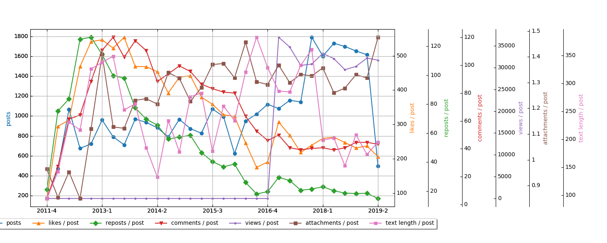

Данные по месяцам:

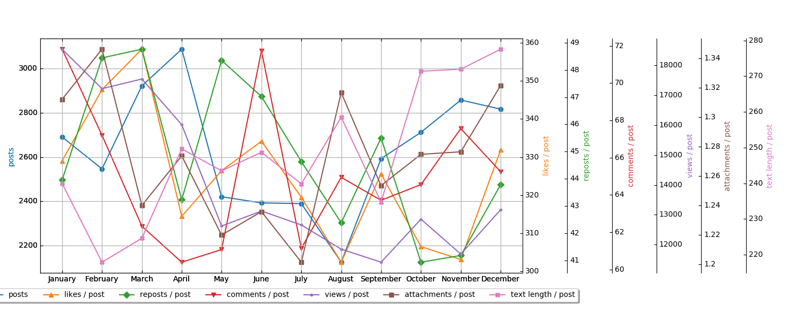

Сразу бросаются в глаза два пика по комментированию - удивительно, но больше всего комментируют в январе и июне. В феврале, марте и мае больше всего репостов. Апрель лидирует по количеству постов. С июля по сентябрь народ отдыхает и проявляет минимальную активность. Вложений больше всего в августе и декабре. А средняя длина текстов растет к концу года и достигает пика в декабре.

Данные по дням недели:

Больше всего постов пишется в четверг, а лайков ставится в пятницу. Репостят чаще воскресеные посты, а комментируют вторничные. Меньше всего просмотров у четверговвых постов, а в понедельник и среду максимально среднее значение длины текста. В субботу очень мало лайков и репостов, если вам нужна активность под постом - пишите в другие дни.

Данные по часам:

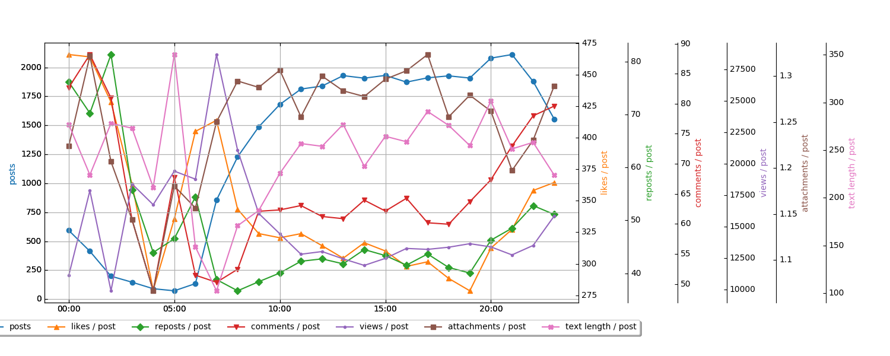

Пик лайков, комментариев и репостов приходится на промежуток 00:00 - 02:00. Видимо, вместо сна подписчики обсуждают, взлетит ли очередной самолет с ленты. Просмотров больше всего в 7-8 утра, когда народ добирается до работы и тупит в телефоны. Неожиданно, но средняя длина текстов максимальна в 5 утра. А вот количество постов вполне ожидаемо растет с 6:00 до 20:00, после чего снижается.

Анализируя графики, не стоит забывать, что ось Y на них не всегда начинается с нуля. Разница между верхним и нижним значением может составлять пару процентов, в то время как на графике это будет выглядеть как разница на порядок.

## Заключение

Вот и все. Если вы хотите самостоятельно изучить данные по Суровому Технарю, смотрите [архив](BrutalEngineer.zip) с csv-таблицами и изображениями png.

Спасибо за внимание! Изучайте данные, это весело.